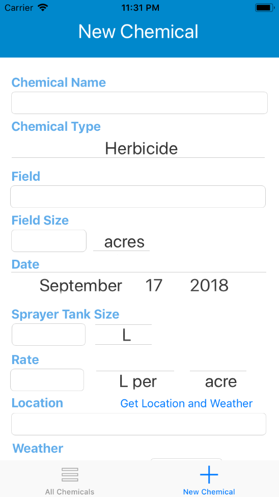

# ChemTrack

An iOS application written in Swift to track agricultural chemical applications.

Rate, field size, and weather can all be easily recorded in order to keep detailed logs of application in order to adhere to Nutrient Management Plans more efficiently.

Main Screen 1
-------------
 

Main Screen 2
-----------

Adding Chemical 1
-----------------
 

Adding Chemical 2
-----------------

